<div align="center">
  <div style="
    font-size: 3rem; 
    font-weight: bold; 
    color: #ffffff; 
    margin: 20px 0; 
    padding: 20px; 
    background: #000000; 
    border-radius: 20px; 
    display: inline-block;
    min-width: 200px;
  ">
    Lead Forge
  </div>
  
  <h3>Modern Lead Management & Sales Pipeline Console</h3>
  
  <p><strong>Transform your sales process with intelligent lead management, opportunity tracking, and data-driven insights.</strong></p>
  
  <h4 style="color: #087f5b; font-style: italic; margin: 20px 0;">"Turning prospects into powerful opportunities."</h4>
  
  [](https://react.dev/)
  [](https://www.typescriptlang.org/)
  [](https://tailwindcss.com/)
  [](https://vitejs.dev/)
</div>

---

## 📋 Table of Contents

- [🎯 Overview](#-overview)
- [✨ Key Features](#-key-features)
- [🖼️ Screenshots](#️-screenshots)
- [🏗️ Architecture](#️-architecture)
- [🚀 Quick Start](#-quick-start)
- [🛠️ Development](#️-development)
- [📊 Data Models](#-data-models)
- [🎮 User Guide](#-user-guide)
- [📱 Browser Support](#-browser-support)
- [🙏 Acknowledgments](#-acknowledgments)
- [🧪 Testing](#-testing)

---

## 🎯 Overview

**Lead Forge** is a cutting-edge, enterprise-grade lead management system designed for modern sales teams. Built with React 19 and TypeScript, it provides an intuitive interface for managing leads, converting opportunities, and tracking sales pipelines with real-time analytics.

### 🔥 **Why "Lead Forge"?**

The name "Lead Forge" represents the transformation process of raw prospects into powerful, qualified opportunities. Just as a blacksmith forges metal into strong, useful tools, Lead Forge transforms unrefined leads into valuable business opportunities through intelligent management, nurturing, and conversion workflows.

### 🚀 **What Lead Forge Delivers**

Lead Forge provides everything your sales team needs to succeed:

- **Complete Lead Management**: Comprehensive lead tracking with search, filtering, and sorting capabilities
- **Advanced Lead Detail Panel**: Powerful slide-over interface with inline editing and validation
- **Seamless Opportunity Conversion**: Transform qualified leads into opportunities with one click
- **Real-time Analytics**: Live dashboard with conversion metrics and pipeline insights
- **Data Persistence**: Automatic data synchronization with local storage
- **Export Capabilities**: CSV export for leads and opportunities with filtering support

---

## ✨ Key Features

### 🎯 **Core Functionality**
| Feature | Description |
|---------|-------------|
| **Lead Management** | Comprehensive lead tracking with search, filtering, and sorting |
| **Opportunity Conversion** | Seamlessly convert qualified leads to opportunities |
| **Pipeline Tracking** | Monitor opportunities through different sales stages |
| **Data Persistence** | Local storage with automatic data synchronization |
| **Export Capabilities** | CSV export for leads and opportunities |

### 🎨 **User Experience**
| Feature | Description |
|---------|-------------|
| **Responsive Design** | Mobile-first approach with desktop optimization |
| **Dark/Light Themes** | System preference detection with manual toggle |
| **Accessibility** | WCAG AA compliant with keyboard navigation |
| **Real-time Updates** | Instant feedback and state synchronization |
| **Smooth Animations** | Subtle transitions and loading states |

### 🔧 **Technical Features**
| Feature | Description |
|---------|-------------|
| **Type Safety** | Full TypeScript implementation with strict typing |
| **Form Validation** | React Hook Form + Zod schema validation |
| **State Management** | Zustand with persistence and optimistic updates |
| **Code Quality** | Biome linting, formatting, and pre-commit hooks |
| **Performance** | Optimized rendering with React 19 features |

### 🚀 **Advanced Features**
| Feature | Description |
|---------|-------------|
| **Analytics Dashboard** | Real-time conversion metrics and pipeline insights |
| **Advanced Filtering** | Multi-criteria search with status and source filters |
| **Theme System** | Dark/light mode with system preference detection |
| **Error Boundaries** | Graceful error handling and recovery mechanisms |
| **Toast Notifications** | User feedback system for all actions |
| **Keyboard Navigation** | Full accessibility with keyboard shortcuts |
| **Pre-commit Hooks** | Automated code quality checks with Husky |

---

## 🖼️ Screenshots

### 📱 **Dashboard Overview**
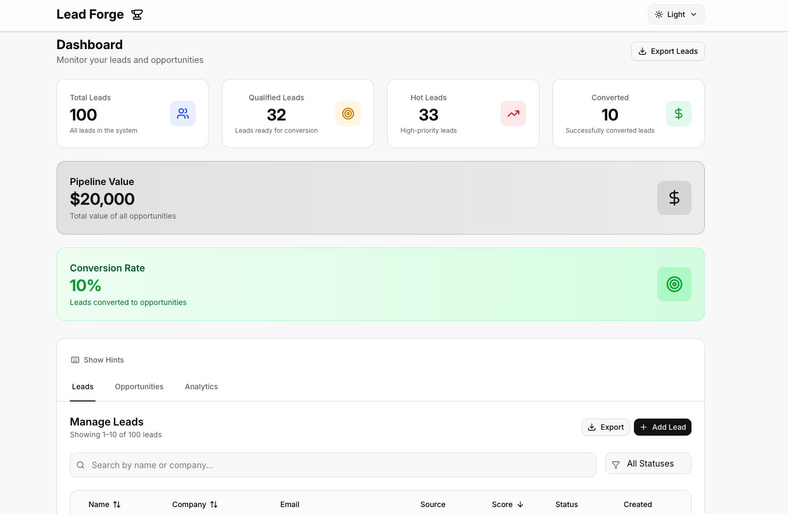
*Clean, modern dashboard interface with stats cards, navigation tabs, and responsive design in light theme*

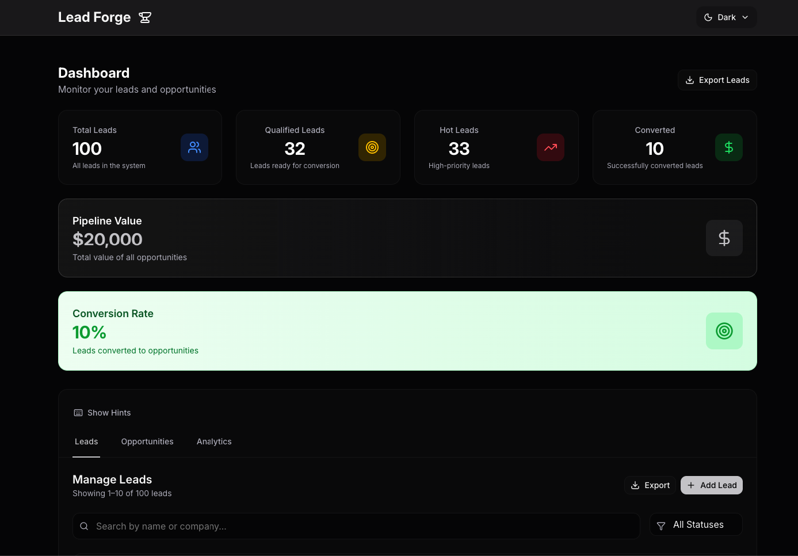
*Elegant dark theme dashboard showcasing the same functionality with sophisticated dark color scheme*

### 📊 **Leads Management**
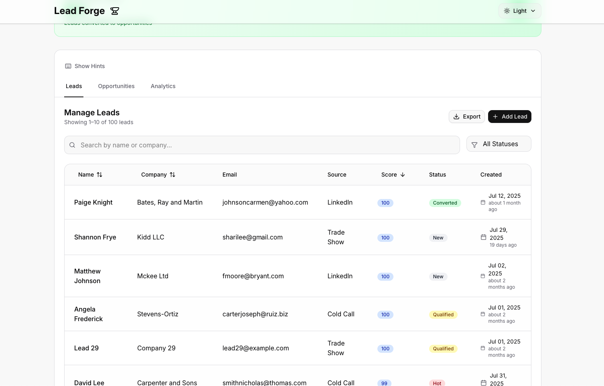
*Comprehensive leads table with search, filtering, sorting, and inline actions - the core of Lead Forge's lead management*

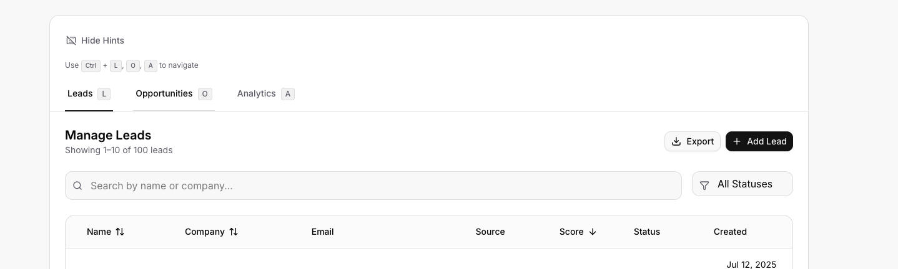
*Keyboard navigation interface showing Ctrl+L, Ctrl+O, Ctrl+A shortcuts for quick tab switching between Leads, Opportunities, and Analytics*

### 💼 **Opportunities Pipeline**
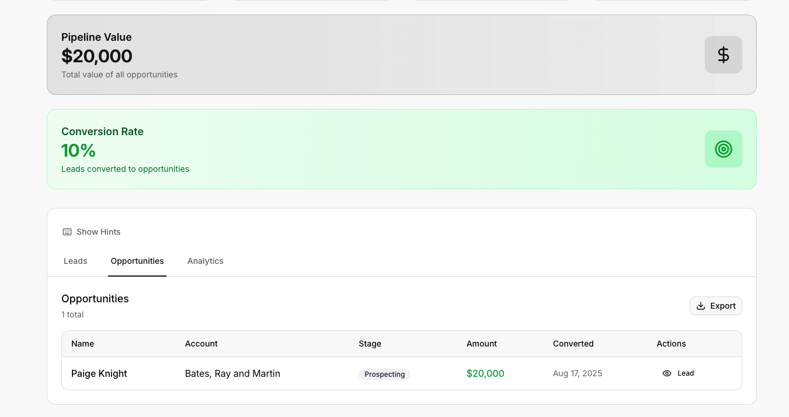
*Opportunities pipeline view displaying converted leads with stage tracking, amount management, and conversion history*

### 📈 **Analytics Dashboard**
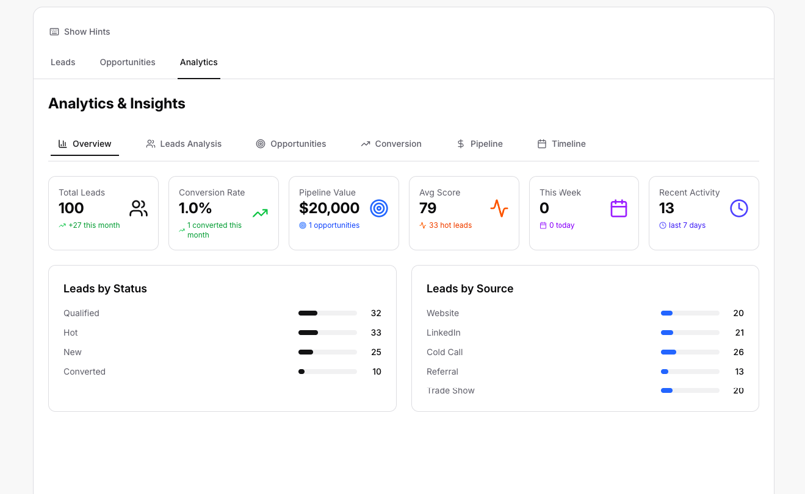
*Real-time analytics overview with conversion metrics, lead sources performance, and pipeline velocity insights*

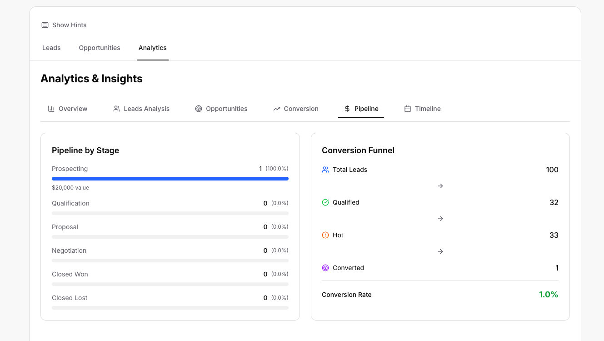
*Pipeline analysis showing opportunity stages, conversion rates, and sales funnel visualization*

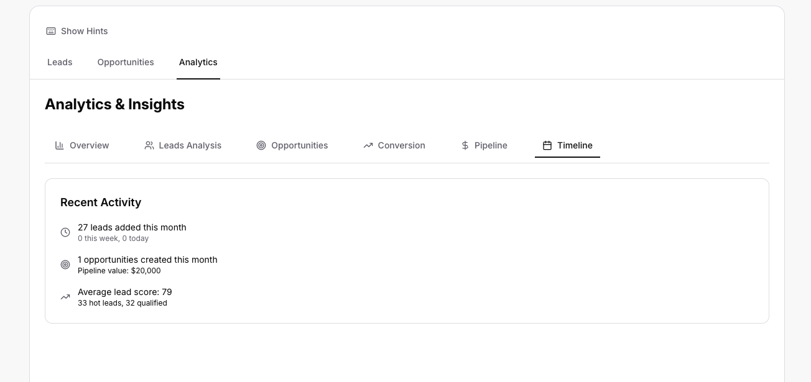
*Timeline view of lead and opportunity activities with trend analysis and performance tracking*

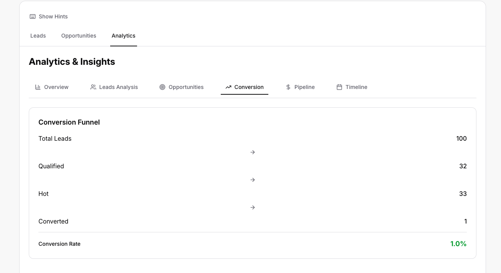
*Conversion analytics displaying lead-to-opportunity success rates and conversion optimization insights*

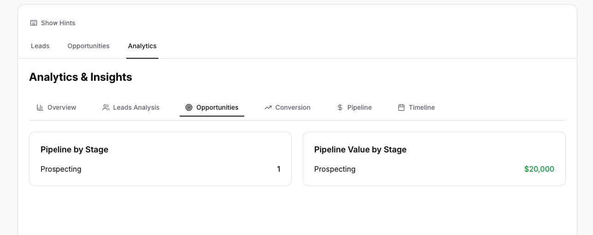
*Opportunity-focused analytics with stage progression, revenue forecasting, and deal velocity metrics*

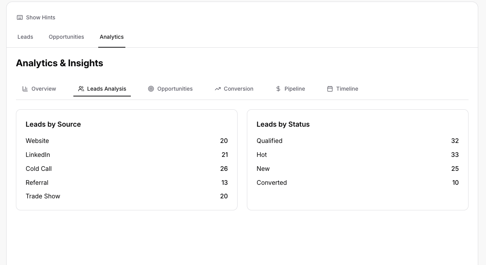
*Comprehensive analysis dashboard combining all metrics for strategic decision-making and performance optimization*

---

## 🏗️ Architecture

Lead Forge follows **Clean Architecture** principles with a domain-driven design approach:

```
src/
├── components/          # React components (UI layer)
│   ├── ui/             # Reusable UI components (shadcn/ui)
│   ├── layout/         # Layout components (Header, Navigation)
│   └── features/       # Feature-specific components
├── domain/             # Business logic and domain models
│   ├── models/         # TypeScript interfaces and types
│   ├── schemas/        # Zod validation schemas
│   ├── infra/          # Infrastructure (store, storage)
│   ├── usecases/       # Business use cases
│   └── services/       # Service layer
├── hooks/              # Custom React hooks
├── lib/                # Utility functions and helpers
├── pages/              # Page components
└── styles/             # Global styles and Tailwind config
```

### **Key Design Principles**

- **🔒 Separation of Concerns**: Clear boundaries between UI, business logic, and data
- **🔄 Dependency Inversion**: High-level modules don't depend on low-level modules
- **🎯 Single Responsibility**: Each module has one reason to change
- **🔌 Interface Segregation**: Clients depend only on interfaces they use
- **🧪 Testability**: All business logic is easily testable
- **📱 Responsiveness**: Mobile-first design with progressive enhancement

---

## 🚀 Quick Start

### **Prerequisites**

- **Node.js** 18.0.0 or higher
- **Yarn** package manager (recommended) or npm
- **Modern browser** with ES2020 support

### **Installation**

```bash
# Clone the repository
git clone https://github.com/your-username/lead-forge.git
cd lead-forge

# Install dependencies
yarn install

# Start development server
yarn dev
```

The application will be available at `http://localhost:5173`

### **Build & Deploy**

```bash
# Build for production
yarn build

# Preview production build
yarn preview

# Deploy to static hosting
# The dist/ folder contains the production build
```

---

## 🛠️ Development

### **Available Scripts**

```bash
# Development
yarn dev              # Start development server
yarn build            # Build for production
yarn preview          # Preview production build

# Code Quality
yarn lint             # Run linting checks
yarn lint:fix         # Fix linting issues
yarn format           # Format code
yarn format:fix       # Fix formatting issues
yarn code:check       # Run all checks
yarn code:fix         # Fix all issues

# Biome (Advanced)
yarn biome:check      # Biome linting
yarn biome:format     # Biome formatting
yarn biome:fix        # Biome auto-fix

# Testing
yarn test:e2e         # Run E2E tests with Playwright
yarn test:e2e:ui      # Run tests with interactive UI
yarn test:e2e:headed  # Run tests in headed mode
yarn test:e2e:debug   # Run tests in debug mode
```

### **Code Style & Quality**

- **TypeScript**: Strict mode enabled with comprehensive type coverage
- **React**: Functional components with hooks, no class components
- **CSS**: Tailwind CSS with custom design tokens
- **Imports**: Absolute imports with `@/` alias for `src/`
- **Linting**: Biome for consistent code style and quality
- **Pre-commit**: Husky hooks for automated quality checks

---


## 📊 Data Models

### **Lead Model**
```typescript
interface Lead {
  id: string;
  name: string;
  company: string;
  email: string;
  source: LeadSource;
  score: number;
  status: LeadStatus;
  createdAt: string;
  lastContacted?: string;
  convertedAt?: string;
}
```

### **Opportunity Model**
```typescript
interface Opportunity {
  id: string;
  name: string;
  stage: OpportunityStage;
  amount?: number;
  accountName: string;
  convertedFrom: string;
  convertedAt: string;
}
```

### **Data Sources & Statuses**

| Category | Options |
|----------|---------|
| **Lead Sources** | Website, LinkedIn, Referral, Cold Call, Trade Show |
| **Lead Statuses** | New, Qualified, Hot, Converted |
| **Opportunity Stages** | Prospecting, Qualification, Proposal, Negotiation, Closed Won, Closed Lost |

---

## 💼 Use Cases

### **Sales Teams & Sales Managers**

**Lead Qualification & Prioritization**
- **Challenge**: Managing hundreds of leads with varying quality and urgency
- **Solution**: Lead Forge's scoring system and status management help prioritize high-value prospects
- **Benefit**: Focus efforts on leads most likely to convert, improving conversion rates

**Pipeline Visibility & Forecasting**
- **Challenge**: Lack of real-time visibility into sales pipeline and conversion stages
- **Solution**: Real-time dashboard showing lead-to-opportunity conversion metrics
- **Benefit**: Accurate forecasting and better resource allocation

**Team Performance Tracking**
- **Challenge**: Difficulty tracking individual and team performance metrics
- **Solution**: Analytics dashboard with conversion rates, pipeline velocity, and source effectiveness
- **Benefit**: Data-driven performance management and coaching opportunities

### **Marketing Teams**

**Lead Source Optimization**
- **Challenge**: Understanding which marketing channels generate the highest-quality leads
- **Solution**: Source tracking and conversion analytics by lead source
- **Benefit**: Optimize marketing spend on high-performing channels

**Lead Nurturing Campaigns**
- **Challenge**: Managing ongoing communication with prospects at different stages
- **Solution**: Status-based lead categorization and last contact tracking
- **Benefit**: Timely follow-ups and improved lead engagement

**ROI Measurement**
- **Challenge**: Measuring marketing campaign effectiveness and lead quality
- **Solution**: Conversion tracking from lead to opportunity with detailed analytics
- **Benefit**: Clear ROI metrics for marketing investments

### **Business Development Representatives (BDRs)**

**Prospect Research & Outreach**
- **Challenge**: Managing multiple outreach campaigns and follow-up schedules
- **Solution**: Lead status tracking and last contact date management
- **Benefit**: Systematic follow-up processes and improved response rates

**Territory Management**
- **Challenge**: Organizing leads by geographic region, industry, or company size
- **Solution**: Company and industry-based filtering and categorization
- **Benefit**: Targeted outreach strategies and better territory coverage

**Performance Metrics**
- **Challenge**: Tracking individual outreach effectiveness and conversion rates
- **Solution**: Personal performance dashboards and conversion analytics
- **Benefit**: Clear performance visibility and improvement opportunities

### **Startups & Small Businesses**

**Customer Acquisition**
- **Challenge**: Limited resources for lead management and sales processes
- **Solution**: Affordable, self-hosted solution with no monthly fees
- **Benefit**: Professional lead management without enterprise costs

**Process Standardization**
- **Challenge**: Ad-hoc lead management leading to missed opportunities
- **Solution**: Structured workflows and consistent lead status management
- **Benefit**: Professional sales processes that scale with business growth

**Data-Driven Decisions**
- **Challenge**: Making sales decisions based on intuition rather than data
- **Solution**: Comprehensive analytics and conversion tracking
- **Benefit**: Informed decision-making and improved sales strategies

### **Enterprise Organizations**

**Multi-Team Coordination**
- **Challenge**: Coordinating lead handoffs between marketing, sales, and account management
- **Solution**: Clear lead status transitions and conversion workflows
- **Benefit**: Smooth handoffs and improved customer experience

**Compliance & Audit**
- **Challenge**: Maintaining audit trails and compliance requirements
- **Solution**: Complete data export capabilities and activity tracking
- **Benefit**: Regulatory compliance and audit readiness

**Scalability & Performance**
- **Challenge**: Managing thousands of leads without performance degradation
- **Solution**: Optimized React 19 architecture with efficient data handling
- **Benefit**: Consistent performance regardless of data volume

---

## 🎮 User Guide

### **Managing Leads**

1. **View Leads**: Navigate to the Leads tab to see all leads
2. **Search & Filter**: Use the search bar and status filter to find specific leads
3. **Sort**: Sort by score, name, or company in ascending/descending order
4. **Edit**: Click on a lead to open the detail panel for inline editing
5. **Convert**: Use the convert button to transform a lead into an opportunity

### **Working with Opportunities**

1. **View Opportunities**: Switch to the Opportunities tab
2. **Track Progress**: Monitor opportunities through different pipeline stages
3. **Update Stages**: Change opportunity stages as deals progress
4. **View Source**: Click on an opportunity to see the original lead

### **Data Export**

- **Export Leads**: Download lead data as CSV from the leads table
- **Export Opportunities**: Download opportunity data as CSV from the opportunities table
- **Filtered Export**: Export only filtered/visible data

---

## 📱 Browser Support

| Browser | Version | Status |
|---------|---------|---------|
| **Chrome** | 90+ | ✅ Supported |
| **Firefox** | 88+ | ✅ Supported |
| **Safari** | 14+ | ✅ Supported |
| **Edge** | 90+ | ✅ Supported |

---


## 🧪 Testing

### **Testing Strategy** 🎯

Our testing approach focuses on **End-to-End (E2E) testing** using Playwright to ensure complete user workflows function correctly across all browsers and devices.

### **E2E Testing Stack** ⭐

- **Framework**: Playwright (cross-browser testing)
- **Coverage**: Complete user journeys and critical business flows
- **Browsers**: Chromium, Firefox, WebKit, Mobile Chrome
- **Features**: Screenshots on failure, traces for debugging

### **Running Tests**

```bash
# Run all E2E tests
yarn test:e2e

# Run tests with UI mode (interactive)
yarn test:e2e:ui

# Run tests in headed mode (see browser)
yarn test:e2e:headed

# Run tests in debug mode
yarn test:e2e:debug
```

### **Test Reports**

After running tests, HTML reports are generated:
```bash
npx playwright show-report
```

---

<div align="center">
  <h3>🚀 Ready to transform your sales process?</h3>
  <p><strong>Lead Forge - Where leads become opportunities, and opportunities become revenue.</strong></p>
  
  **Made with ❤️ by the Lead Forge Team**
</div>